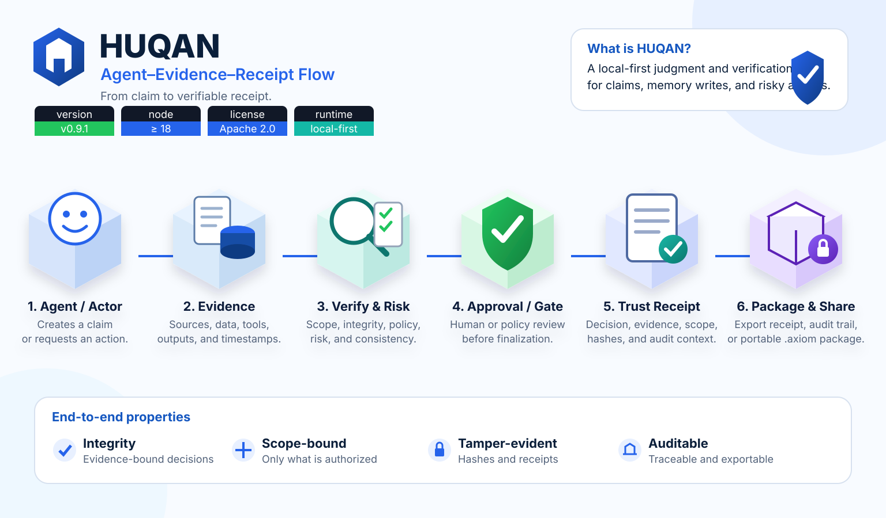
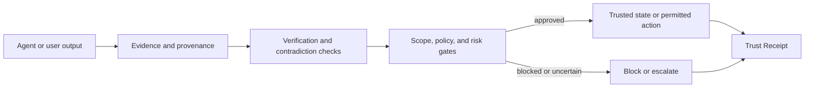

# HUQAN

### Models generate. Agents act. Memory stores. **HUQAN judges.**

HUQAN is a **local-first AI governance, agent-safety, and verification layer** for claims, memory writes, and risky actions. It connects AI-assisted work to evidence, provenance, scope, policy, approval, and auditable Trust Receipts.

[](./package.json)
[](https://nodejs.org/)
[](./LICENSE)
[](https://github.com/ali-ulu/huqan/stargazers)
[](https://github.com/ali-ulu/huqan/forks)
[](https://github.com/ali-ulu/huqan/issues)
[](https://github.com/ali-ulu/huqan/commits/main)
[](https://snikus.com/startup.php?id=17)

[Quick start](#quick-start) · [Why HUQAN](#why-huqan) · [How it works](#how-it-works) · [Ways to run](#ways-to-run) · [Current scope](#current-scope)

**Canonical repository:** `https://github.com/ali-ulu/huqan`

<p align="center">
  
</p>

## What is HUQAN?

AI systems can produce useful outputs without showing:

- what source supports a claim,
- which workspace or scope applies,
- whether a risky action was approved,
- what changed later,
- or why a result was allowed, blocked, or escalated.

HUQAN adds a deterministic, auditable trust boundary around those decisions on its tested local paths.

```text
claim or action
      ↓
evidence + provenance + scope + policy
      ↓
verification + contradiction + risk gates
      ↓
ALLOW / BLOCK / ESCALATE
      ↓
Trust Receipt + audit context
```

HUQAN is not another LLM. Its core local graph, verification, gate, and receipt paths do not require a hosted model or cloud service.

## Why HUQAN?

| Need | HUQAN provides |
|---|---|
| **Repeatable decisions** | Deterministic verification and policy outcomes on tested paths |
| **Evidence traceability** | Provenance, graph evidence, reasoning context, and receipt links |
| **Safer AI agents** | Explicit review, block, escalation, and dry-run boundaries |
| **Protected memory** | Admission and workspace checks before canonical memory writes |
| **Auditability** | Trust Receipts and append-oriented audit records |
| **Local operation** | CLI, local server, and MCP flows without a required cloud dependency |

HUQAN is designed for AI governance, agent safety, LLM-output verification, approval workflows, provenance tracking, MCP integrations, and audit-ready AI-assisted work.

## Quick start

### Requirements

- Git
- npm
- **Node.js 20 or newer**
- Node.js 20 LTS or 22 LTS is recommended
- A compiler toolchain may be required if your platform cannot use a prebuilt `better-sqlite3` binary

> The current `better-sqlite3` dependency does not support Node.js 18. Earlier README text that advertised Node.js 18 was stale.

### Install from the canonical repository

Using HTTPS:

```bash
git clone https://github.com/ali-ulu/huqan.git
cd huqan
npm ci
```

Using GitHub CLI:

```bash
gh repo clone ali-ulu/huqan
cd huqan
npm ci
```

### Fix an existing clone that still points to an old repository name

```bash
git remote set-url origin https://github.com/ali-ulu/huqan.git
git remote -v
```

The `origin` fetch and push URLs should both be:

```text
https://github.com/ali-ulu/huqan.git
```

### Your first Trust Receipt

One command, no API key, no config file to edit:

```bash
npm ci
node cli.js quickstart
```

This runs the real pipeline end to end — `axiom.learn` is proposed, the
mutation gate answers `review`, an approval is persisted, `axiom.approve`
performs the canonical write, the claim is verified against the graph, and the
resulting Trust Receipt is printed:

```text
HUQAN quickstart — learn -> review -> approve -> verify -> Trust Receipt
  1. OK   propose: axiom.learn -> review (mutating_requires_review), approval approval-…
  2. OK   approve: axiom.approve -> approved (actor cli-quickstart)
  3. OK   verify: verified (confidence 0.90)
  4. OK   receipt: receiptId … (status canonical)
```

Quickstart runs in a throwaway store in your temp directory; it does not write
to your own memory, and it does not relax any gate.

### Verify the local SQLite dependency and test suite

```bash
node -e "const Database=require('better-sqlite3'); const db=new Database(':memory:'); db.close(); console.log('SQLite OK')"
npm test
```

### Start the CLI

```bash
npm start
```

Direct invocation remains available:

```bash
node cli.js
```

Example controlled statements:

```text
Smoking causes lung cancer
Vaccination prevents disease
Authentication enables secure access
Growth depends on investment
```

HUQAN currently handles explicit supported relation markers. It is not a general-purpose natural-language understanding engine.

## How it works



The main runtime layers are:

```text
CLI / REST / MCP / local UI
            ↓
agent routing and task dispatch
            ↓
safety gates and approval boundaries
            ↓
verification and graph reasoning
            ↓
provenance, receipts, and memory admission
            ↓
SQLite-backed local state and audit records
```

## Ways to run

### As a library

```js
const Kernel = require('huqan'); // KernelV2, the canonical runtime
const kernel = new Kernel();
```

`require('huqan')` resolves to `KernelV2`, the same runtime the CLI, REST
server and MCP server build. The older `Kernel` implementation it wraps is
still reachable as `require('huqan').KernelV1`, but it is deprecated, is not a
runtime option, and will be removed in the next major release.

The package root also exposes the general Error Prevention core:

```js
const { createErrorPrevention } = require('huqan');
const prevention = createErrorPrevention(kernel.memory, {
  verifyEvidence,
  resolveApproval,
});
```

This is a package/library surface for verified failure memory, governed rule
lifecycle, and deterministic preflight decisions. It is not one of the eleven
MCP tools advertised below.

### Local CLI

```bash
npm start
```

### Local REST server

Mutation endpoints require an API key.

```bash
HUQAN_API_KEY=replace-with-a-secret npm run server
```

`HUQAN_API_KEY` is the canonical environment-variable name used by the runtime.
See [the environment-variable migration guide](docs/environment-variable-migration.md)
before running canonical and legacy names together.

The server starts at `http://localhost:3000`.

Useful endpoints:

| Endpoint | Method | Purpose |
|---|---:|---|
| `/health` | GET | Health check |
| `/api?q=...` | GET | Allowlisted read-only query surface |
| `/graph-data` | GET | Knowledge graph export |
| `/verify` | POST | Guarded verification |
| `/v2/verify` | POST | Guarded structured verification |
| `/upload` | POST | Guarded load alias |

Authenticated mutation requests use `X-API-Key` or `Authorization: Bearer <key>`.

### MCP server for Claude or Cursor

```bash
npm run mcp
```

Claude Desktop configuration:

```json
{
  "mcpServers": {
    "huqan": {
      "command": "node",
      "args": ["/absolute/path/to/huqan/mcpServer.js"]
    }
  }
}
```

The server advertises eleven tools:

| Tool | What it does | Gate |
| --- | --- | --- |
| `huqan.learn` | Learn a natural-language fact into the local graph | review |
| `huqan.ask` | Ask a grounded question against the graph | allow |
| `huqan.verify` | Verify a statement and return its evidence trail | allow |
| `huqan.plan` | Build a multi-step plan for a goal | allow |
| `huqan.agent` | Run the multi-step agent loop | dry-run only |
| `huqan.policy` | Inspect the execution policy for a requested tool | allow |
| `huqan.approvals` | List pending tool approvals | allow |
| `huqan.approve` | Approve or reject a pending approval | — |
| `huqan.reason` | Return forward and backward reasoning traces | allow |
| `huqan.compare` | Compare two concepts across the graph | allow |
| `huqan.dream` | Generate ranked hypotheses from the graph | allow |

The legacy `axiom.*` names from before the HUQAN rename are still accepted, so
existing installs keep working; they are no longer advertised, and a call using
one returns a `meta.deprecation` notice. See
[docs/mcp-tool-name-migration.md](docs/mcp-tool-name-migration.md).

## Core capabilities

- Graph-backed claim verification
- Contradiction detection
- Explicit `CAUSES`, `PREVENTS`, `ENABLES`, and `DEPENDS_ON` relations
- Memory admission and workspace isolation
- Risk classification and safety gates
- Approval flows for guarded actions
- Provenance and audit records
- Canonical Trust Receipts and receipt chains
- Verified failure memory and deterministic Error Prevention preflight
- Portable `.huqan` package primitives with legacy `.axiom.json` reader compatibility
- CLI, REST, MCP, and local UI surfaces

## Current scope

HUQAN is currently a **local-first partial trust layer**.

What is real today:

- verification, graph, provenance, approval, audit, and receipt primitives,
- verified-failure Error Prevention core exposed through the package root,
- local CLI, REST, MCP, and UI surfaces,
- bounded memory and action gates,
- canonical HUQAN package and cryptographic foundations.

What this repository does **not** currently claim:

- universal truth or hallucination elimination,
- complete inline enforcement for every connector and mutation path,
- a finished V5 shared-trust ecosystem,
- a public agent marketplace or certification network,
- Wikipedia-scale graph performance,
- a complete autonomous Self-Healer.

### Shipped but not wired

Part of this repository is implemented and unit-tested but is **not reached by
the production entry-point graph** declared in
[`lib/module-reachability.js`](./lib/module-reachability.js): `cli.js`,
`server.js`, `mcpServer.js`, `index.js`, `kernel.js`, and
`github-app-server.js` (plus dynamically loaded plugin entry points). Green
tests for those unreached modules mean the code behaves as specified in
isolation — they are not evidence that the product runs it.

That set is enumerated with a reason per module in
[`lib/module-reachability.js`](./lib/module-reachability.js) and enforced by a
test, so nothing can join it silently. The largest groups today are the
external-client trust boundary (decided in ADR-010 but deliberately not
enabled), the V5 track (its entry audit has not passed), the reviewed external
ingest chain, and the Self-Healer (library-only by design).

The Error Prevention core is not in that unwired set: `index.js` reaches and
exports it as a package/library surface. No Error Prevention MCP tool is
currently advertised.

For the live execution order and exact limitations, read [docs/current-operating-roadmap.md](./docs/current-operating-roadmap.md).

## Repository map

| Path | Purpose |
|---|---|
| `kernel.js`, `graph.js` | Verification and graph reasoning core |
| `lib/` | Gates, provenance, memory, receipts, viewers, and supporting modules |
| `cli.js` | Local command-line interface |
| `server.js` | Local REST server and UI delivery |
| `mcpServer.js` | MCP integration |
| `public/` | Backend-connected local UI |
| `test/` and `*.test.js` | Automated test coverage |
| `docs/` | Architecture, audits, product boundaries, and roadmap |

## Development

```bash
npm test
npm run bench
npm run bench:verify
```

Focused test commands are available in [`package.json`](./package.json).

## Documentation and support

- [Current operating roadmap](./docs/current-operating-roadmap.md)
- [Product surfaces](./docs/product-surfaces.md)
- [Competitive positioning](./docs/competitive-positioning.md)
- [NLP boundary](./docs/nlp-boundary.md)
- [Scale truth pack](./docs/scale-truth-pack.md)
- [Governance](./docs/governance.md)
- [Security policy](./SECURITY.md)
- [Contributing](./CONTRIBUTING.md)
- [Issues](https://github.com/ali-ulu/huqan/issues)
- [Discussions](https://github.com/ali-ulu/huqan/discussions)

## License

GNU Affero General Public License v3.0 (AGPL-3.0). See [LICENSE](./LICENSE) and [NOTICE](./NOTICE).

---

**HUQAN:** trust and evidence infrastructure for AI-mediated work.
