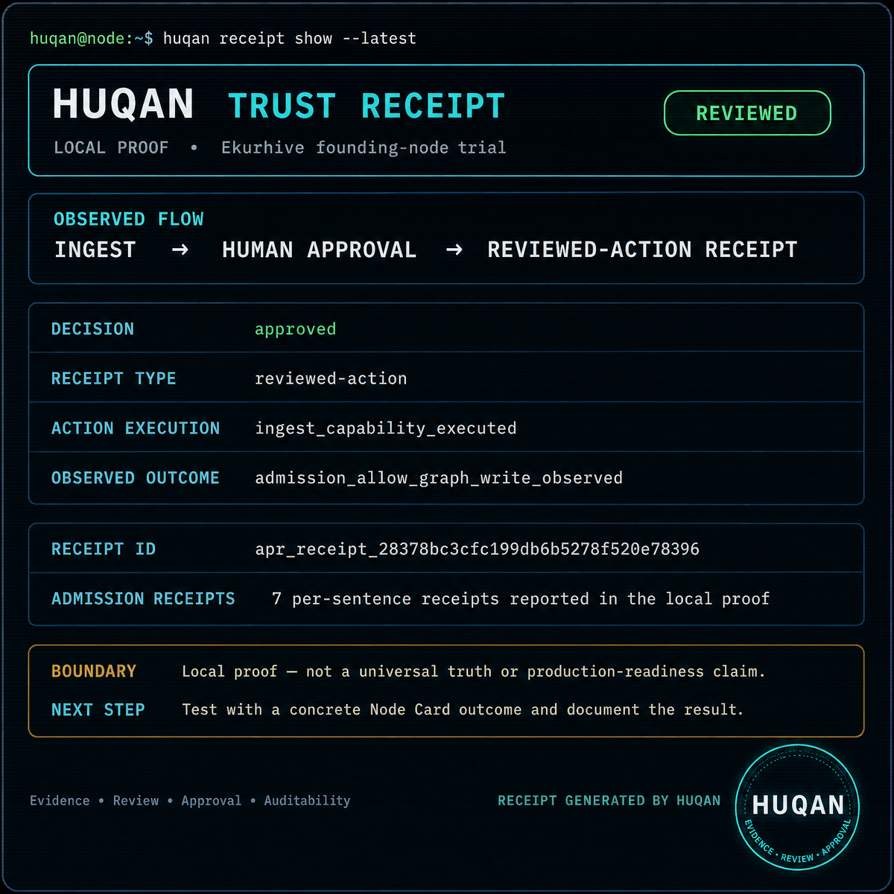
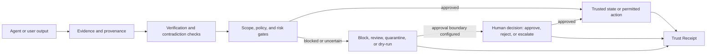

# HUQAN

> **Confidence is not truth. Verify before you trust.**

**HUQAN is a local-first, partial-trust AI governance and verification layer for claims, memory writes, and selected agent actions.** It connects AI-assisted work to evidence, provenance, workspace scope, policy, approval, verification, risk gates, audit records, and Trust Receipts.

HUQAN is **not an LLM**, a universal truth engine, or a promise that hallucinations will disappear. Its purpose is narrower and practical: to make supported AI-agent workflows more observable, reviewable, and accountable before an output becomes a memory entry, decision, or real-world action.

[](./package.json)
[](https://nodejs.org/)
[](./LICENSE)
[](https://github.com/ali-ulu/huqan/stargazers)
[](https://github.com/ali-ulu/huqan/forks)
[](https://github.com/ali-ulu/huqan/issues)
[](https://github.com/ali-ulu/huqan/commits/main)

[Quick start](#quick-start) · [What is HUQAN?](#what-is-huqan) · [How it works](#how-it-works) · [Capabilities](#current-capabilities) · [Ways to run](#ways-to-run) · [FAQ](#faq) · [Current scope](#current-scope)

**Canonical repository:** <https://github.com/ali-ulu/huqan>

<p align="center">
  
</p>

<p align="center"><em>A bounded local Trust Receipt pilot — evidence, review, approval, and audit context; not a universal truth or production-readiness claim.</em></p>

## What is HUQAN?

AI systems can produce useful outputs while leaving important questions unanswered:

- What evidence supports the claim?
- Which provenance and workspace scope apply?
- Was a memory write or risky action reviewed?
- Which policy and risk checks were used?
- Why was the result allowed, blocked, or escalated?
- What auditable record remains after the decision?

HUQAN adds a **bounded, deterministic, and auditable trust boundary** around these questions on its tested local paths. It does not make the underlying model truthful by itself. Instead, it helps a developer or operator inspect the evidence and decision context before trusting a supported result.

> **Short definition:** HUQAN is local-first governance infrastructure for evidence, provenance, policy, approval, verification, and Trust Receipts around AI-assisted work.

## Why HUQAN?

The central distinction is between an AI system **generating** an output and a person or system **trusting** that output. HUQAN focuses on the boundary between those two events.

| Need | HUQAN’s bounded contribution |
|---|---|
| Evidence traceability | Graph-backed evidence, provenance references, scope context, and receipt links |
| Repeatable checks | Deterministic verification, contradiction checks, and policy outcomes on tested paths |
| Agent-action review | Review, approval, dry-run, and block boundaries on supported paths, with escalation available where an approval boundary is configured |
| Protected memory | Admission and workspace checks before canonical memory writes |
| Auditability | Append-oriented audit context, canonical Trust Receipts, and receipt chains |
| Local-first operation | CLI, local REST server, MCP, library, and local UI surfaces without a required hosted model |

## How it works

```text
claim, memory write, or agent action
                ↓
evidence + provenance + workspace scope
                ↓
verification + contradiction + risk checks
                ↓
policy decision and approval boundary
                ↓
ALLOW / REVIEW / QUARANTINE / DRY-RUN ONLY / BLOCK / REJECT
                ↓
Trust Receipt + audit context
```

Not every outcome is available on every path. The gate that guards tool calls
answers `allow`, `review`, `dry_run_only` or `block`; the memory admission gate
adds `quarantine` and `reject`, because a write can be held aside for
inspection rather than refused outright.

**Escalation is a decision a person makes, not one the gate returns.** Where an
approval boundary is configured, a reviewer can escalate a pending case instead
of deciding it: the case moves to `escalated` and nothing executes until the
authority it was raised to decides. That is a multi-party control, so it earns
its place in an organization with more than one approver and is simply absent
in a single-user install — there is no second authority to raise a case to. The
decision types are `approve`, `reject`, `expire`, `cancel`, `escalate` and
`override`; see `lib/human-oversight-approval-runtime.js`.

The main local runtime flow is:



A passing verification result is not a universal certificate of truth. It is a result produced within the configured evidence, provenance, workspace, policy, and runtime boundary.

## Quick start

### Requirements

You need Git, npm, and **Node.js 22.13.0 or newer**. Node.js 22 LTS or 24 LTS is recommended. A compiler toolchain may be required on platforms that cannot use a prebuilt `better-sqlite3` binary.

### Install the published package

```bash
npm install -g huqan
```

This installs two commands:

- `huqan` — the local CLI.
- `huqan-mcp` — the MCP server over stdio.

Neither command requires a configuration file or API key merely to start.

For a one-off run without a global install:

```bash
npx -y huqan quickstart
```

### Run from source

```bash
git clone https://github.com/ali-ulu/huqan.git
cd huqan
npm ci
node cli.js quickstart
```

`gh repo clone ali-ulu/huqan` can be used instead of `git clone`.

### Your first Trust Receipt

```bash
huqan quickstart
```

From a source checkout, use `npm ci && node cli.js quickstart`. The quickstart exercises the local pipeline: propose a `huqan.learn` mutation, receive a review decision, persist approval, perform the canonical write, verify the claim against the graph, and print the resulting Trust Receipt.

Typical output has this shape:

```text
HUQAN quickstart — learn -> review -> approve -> verify -> Trust Receipt
  1. OK   propose: huqan.learn -> review (mutating_requires_review), approval approval-…
  2. OK   approve: huqan.approve -> approved (actor cli-quickstart)
  3. OK   verify: verified (confidence 0.90)
  4. OK   receipt: receiptId … (status canonical)
```

The quickstart uses a throwaway store in the temporary directory. It does not write to your own memory and does not relax a gate.

### Run the bounded Trust Receipt pilot

The repository also contains a bounded local Trust Receipt pilot:

```bash
npm run pilot:trust-receipt
```

Treat this as a scoped pilot and test surface, not as evidence of a complete shared-trust ecosystem or universal production readiness.

### Optional smaller installation

PDF ingest (`pdfjs-dist`) and PDF receipt export (`pdfkit`) are optional dependencies. To omit them:

```bash
npm install -g huqan --omit=optional
```

Reading a PDF or exporting a receipt as PDF then requires the corresponding package. JSON receipt export and other adapters remain separate paths.

## Current capabilities

The current repository exposes the following primitives and developer surfaces. Each capability remains bounded by its specific adapter, policy, workspace, approval, and runtime path.

| Capability | What is documented or exercised |
|---|---|
| Graph-backed verification | Claims and relationships can be checked against the local graph on supported paths |
| Evidence and provenance | Verification and receipt flows preserve source and decision context where the path provides it |
| Contradiction checks | Supported verification paths can surface conflicting evidence instead of silently treating every claim as accepted |
| Explicit relations | The current natural-language boundary includes `CAUSES`, `PREVENTS`, `ENABLES`, and `DEPENDS_ON` markers |
| Memory admission | Canonical memory writes pass through admission and workspace checks |
| Policy and risk gates | Supported actions can produce `allow`, `block`, `review`, `escalate`, or `dry_run_only` outcomes |
| Human approval | Guarded mutations can require a separate approval step before the canonical write or action path |
| Trust Receipts | Canonical receipt records preserve bounded evidence, provenance, decision, and audit context |
| Error Prevention | The package root exposes a verified-failure and deterministic preflight core |
| Package primitives | `.huqan` package primitives exist with legacy `.axiom.json` reader compatibility where documented |
| Developer surfaces | CLI, REST, MCP, library, local UI, and read-only Trust Receipt Viewer surfaces are present |
| A2A transport | Four routes are shipped but deployment-gated and unconfigured by default |
| Agent Action Firewall | Production-wired coverage exists for documented classic agent, workflow/HTTP, and MCP action paths; it is not universal connector enforcement |

## Ways to run

### As a library

```js
const Kernel = require('huqan'); // KernelV2, the canonical runtime
const kernel = new Kernel();
```

`require('huqan')` resolves to `KernelV2`, the runtime used by the CLI, REST server, and MCP server. The older `KernelV1` compatibility surface remains reachable as `require('huqan').KernelV1`, but it is deprecated and is not the canonical runtime option.

The package root also exposes the Error Prevention core:

```js
const { createErrorPrevention } = require('huqan');
const prevention = createErrorPrevention(kernel.memory, {
  verifyEvidence,
  resolveApproval,
});
```

This is a package/library surface for verified failure memory, governed rule lifecycle, and deterministic preflight decisions. It is not an additional MCP tool.

### Local CLI

```bash
npm start
```

Direct invocation remains available:

```bash
node cli.js
```

HUQAN currently handles explicit supported relation markers. It is not a general-purpose natural-language understanding engine.

### Local REST server

Mutation endpoints require an API key:

```bash
HUQAN_API_KEY=replace-with-a-secret npm run server
```

The server starts at `http://localhost:3000`.

Useful endpoints include:

| Endpoint | Method | Purpose |
|---|---:|---|
| `/health` | GET | Health check |
| `/api?q=...` | GET | Allowlisted read-only query surface |
| `/graph-data` | GET | Knowledge graph export |
| `/verify` | POST | Guarded verification |
| `/v2/verify` | POST | Guarded structured verification |
| `/upload` | POST | Guarded load alias |

Authenticated mutation requests use `X-API-Key` or `Authorization: Bearer <key>`. Review the route contract and workspace authorization policy before exposing a local server beyond its intended boundary.

### MCP server for Claude or Cursor

```bash
huqan-mcp
```

Claude Desktop configuration with no prior global installation:

```json
{
  "mcpServers": {
    "huqan": {
      "command": "npx",
      "args": ["-y", "--package=huqan", "huqan-mcp"]
    }
  }
}
```

`--package=huqan` is required because the binary name differs from the package name. From a source checkout, use `"command": "node"` with `"args": ["/absolute/path/to/huqan/mcpServer.js"]`.

The model-visible MCP catalog includes tools for learning, asking grounded questions, verification, planning, bounded agent execution, ingest preview/status, policy inspection, reasoning traces, comparison, hypothesis generation, advocacy, scoped search, Trust Receipt reading, and recursive knowledge synthesis (`huqan.fractal-learn`, optionally self-tuning through its one-way `autoTune` mode — it can tighten its own thresholds but never loosen them).

`huqan.self-evolve` runs that same synthesis loop and then a measured self-evolution pass, and reports which of the two moved: its verdict distinguishes a run that only changed graph content (`native-content-only`) from one that also changed the thresholds producing it (`native-writes-config`), with `inactive` when nothing moved. It is classified as a mutating write and is held for human review exactly like `huqan.fractal-learn`, so the reach it adds is in what an approved run may change, not in what it may bypass.

Operator-only tools are deliberately withheld from `tools/list` and require `HUQAN_MCP_OPERATOR_TOKEN`:

| Tool | Purpose |
|---|---|
| `huqan.approve` | Approve or reject a pending approval |
| `huqan.approvals` | List pending approvals |
| `huqan.agent_resume` | Resume a suspended agent run |

This separation means a model that proposes a mutating action cannot also approve it through the model-visible catalog.

Operator capabilities are single-use, and the record of a spent one is durable
(#1674). Consumed nonces are written to `.huqan-capability-nonces` beside the
memory store, so a capability that was already used stays used across a restart
and across workers; set `HUQAN_MCP_CAPABILITY_NONCE_DIR` to point every worker
at one shared writable directory when the default is not on shared storage. If
that directory cannot be written, capability verification fails closed rather
than falling back to memory-only replay protection.

### Local UI and Trust Receipt Viewer

Start the local server to serve the backend-connected developer UI:

```bash
npm run server
```

The canonical local UI is `public/index.html`. The read-only Trust Receipt Viewer is available at `/viewer` on a running server and renders receipts already owned by that local server. It is not a mutation surface and is not a public static marketing demo.

For an observability walkthrough covering local server telemetry, tool usage, alerts, queue state, and dashboard steps, see [Observability Quickstart](./docs/product-hunt-quickstart.md). For framework lifecycle integration through the stable local telemetry client, see [Observability Telemetry Client](./docs/observability-client.md).

### Optional Rust graph accelerator

The repository contains an optional `huqan-core` Rust JSON-IPC accelerator. It is not required for the normal CLI, server, MCP, or canonical `kernel.learn()` path. When the binary is unavailable, the JavaScript path remains the reference behavior.

```bash
cd huqan-core
cargo build --release
cd ..
```

To select a binary elsewhere, set `HUQAN_RUST_BIN` before starting Node. Compare the optional path with:

```bash
node benchmarks/rust-vs-js-graph.js 2000
```

The benchmark does not claim Rust throughput when no binary is present.

## Current scope

HUQAN is currently a **local-first partial-trust governance layer**. The project is strongest where it can observe a supported flow, attach evidence and provenance, evaluate configured gates, require approval where applicable, and create a bounded audit or Trust Receipt record.

### Shipped and bounded

The repository contains local verification, graph, provenance, approval, audit, receipt, memory, action-gate, CLI, REST, MCP, UI, and package primitives. It also contains two repository-run conformance suites:

```bash
npm run conformance:external
npm run conformance:a2a
```

These suites are evidence for the tested cases and implementations they cover. They are not third-party certification or proof of universal interoperability.

### A2A routes are deployment-gated

Four routes are mounted through `lib/a2a/routes.js`:

- `POST /api/a2a/exchange`
- `GET /.well-known/agent-card.json`
- `POST /api/a2a/negotiate`
- `GET /api/a2a/tasks/{taskId}`

With `HUQAN_A2A_AUTHORITY_FILE` and `HUQAN_A2A_REPLAY_DIR` unset, the routes answer `404` rather than `401`; an unconfigured installation therefore does not advertise a surface it cannot serve. The exchange route has additional package/runtime conditions documented in [A2A deployment](./docs/a2a-deployment.md).

### Implemented but not production-reachable

Some modules are implemented and unit-tested but are not reached by the production entry-point graph declared in [`lib/module-reachability.js`](./lib/module-reachability.js). A passing unit test for such a module proves isolated behavior only; it does not prove that the installed product executes that module.

The current reachability report includes bounded V5, Self-Healer, and connector entries. See the live report and [Current Operating Roadmap](./docs/current-operating-roadmap.md) before describing any of them as generally available.

### What HUQAN does not claim

HUQAN does not claim:

- universal truth or elimination of AI hallucinations;
- complete inline enforcement for every connector, agent, or mutation path;
- a finished V5 shared-trust ecosystem;
- external third-party interoperability for the A2A transport;
- a public agent marketplace, certification network, public badge, or reputation economy;
- Wikipedia-scale graph performance;
- a complete autonomous Self-Healer;
- that a design document, roadmap, or isolated unit test is equivalent to production deployment evidence;
- that HUQAN replaces IAM, application security, infrastructure security, data protection, or human governance.

## FAQ

### Is HUQAN an AI model?

No. HUQAN is a local-first governance and verification layer around supported AI-assisted workflows. It does not replace the language model that generated an output.

### Does HUQAN eliminate hallucinations?

No. HUQAN does not promise to eliminate hallucinations. It helps a supported workflow inspect evidence and provenance, apply configured policies and approval boundaries, and record the resulting decision context.

### What is a Trust Receipt?

A Trust Receipt is a bounded, auditable record of a supported verification or action-governance flow. It can preserve evidence, provenance, scope, risk, review, approval, and the resulting decision. It is not a universal certificate that a claim is true.

### Can HUQAN block an agent action?

On supported and wired execution paths, HUQAN can produce decisions such as `allow`, `review`, `dry_run_only`, or `block`. Coverage must be verified for the particular connector, mutation path, identity, policy, and deployment configuration. HUQAN does not claim universal enforcement.

### Does HUQAN replace enterprise security?

No. HUQAN complements identity and access management, application security, infrastructure security, data protection, and human oversight. It does not replace those controls.

### Can HUQAN run locally without a hosted model?

The core local graph, verification, gate, and receipt paths do not require a hosted model or cloud service. Optional adapters, integrations, and deployment-gated surfaces may have their own requirements.

### What does “partial trust” mean?

It means that a result is evaluated within explicit evidence, provenance, workspace, policy, approval, and runtime boundaries. HUQAN does not treat every model output, memory entry, connector, or external action as automatically trustworthy.

### Where should I start?

Run `huqan quickstart`, inspect the generated Trust Receipt, then read the relevant guide for verification, provenance, policy, approval, memory admission, Agent Action Firewall coverage, and security assumptions.

## Repository map

| Path | Purpose |
|---|---|
| `index.js`, `index.d.ts` | Package exports and public type surface |
| `kernel.js`, `graph.js` | Verification and graph reasoning core |
| `lib/` | Gates, provenance, memory, receipts, viewer, adapters, and supporting modules |
| `cli.js` | Local CLI entry point |
| `server.js` | Local REST server and UI delivery |
| `mcpServer.js`, `bin/huqan-mcp.js` | MCP integration and package binary |
| `public/` | Backend-connected local UI and read-only viewer |
| `test/` and `*.test.js` | Automated test coverage |
| `docs/` | Architecture, audits, contracts, product boundaries, and roadmap |
| `scripts/` | Conformance, pilot, benchmark, and repository tooling |

## Development and verification

Install dependencies and run the test suite:

```bash
npm ci
npm test
```

Useful focused checks include:

```bash
npm run test:cli
npm run test:server
npm run test:plugin
npm run test:backup
npm run conformance:external
npm run conformance:a2a
npm run bench
npm run bench:verify
```

If a focused test passes, report it as evidence for that focused behavior. Do not describe it as full-suite or production evidence without the corresponding test, CI, and runtime proof.

## Documentation and support

- [Current operating roadmap](./docs/current-operating-roadmap.md)
- [Product surfaces](./docs/product-surfaces.md)
- [Competitive positioning](./docs/competitive-positioning.md)
- [NLP boundary](./docs/nlp-boundary.md)
- [Scale truth pack](./docs/scale-truth-pack.md)
- [Governance](./docs/governance.md)
- [Agent Action Firewall](./docs/agent-action-firewall.md)
- [A2A deployment](./docs/a2a-deployment.md)
- [HTTP upload approval contract](./docs/http-upload-approval-contract.md)
- [Security policy](./SECURITY.md)
- [Contributing](./CONTRIBUTING.md)
- [Issues](https://github.com/ali-ulu/huqan/issues)
- [Discussions](https://github.com/ali-ulu/huqan/discussions)

## Evidence and references

The following repository sources define the current scope and are preferred over marketing summaries when a claim needs verification:

1. [Product surfaces](./docs/product-surfaces.md) — canonical local UI, docs entry, and read-only Trust Receipt Viewer boundaries.
2. [Current operating roadmap](./docs/current-operating-roadmap.md) — current execution order and known limitations.
3. [Agent Action Firewall](./docs/agent-action-firewall.md) — supported action-governance boundaries.
4. [A2A deployment](./docs/a2a-deployment.md) — deployment-gated route conditions and limitations.
5. [Module reachability](./lib/module-reachability.js) — distinction between production-reachable and library-only modules.
6. [Package metadata](./package.json) — package version, supported Node.js engine, binaries, and scripts.

## License

HUQAN is currently distributed under the GNU Affero General Public License v3.0, `AGPL-3.0-only`. See [LICENSE](./LICENSE) and [NOTICE](./NOTICE).

A separate commercial license is being prepared for organizations that need proprietary use of covered HUQAN components. The commercial terms are not yet operative and no commercial rights are granted by this repository. Contact the project owner only after an approved commercial agreement is available.

Future external contributions will be subject to the project’s approved contributor rights process. [`CLA.md`](./CLA.md) is currently the versioned review draft `HUQAN-ICLA-v1.0-review` and is not yet an operative agreement. The review contact is Ali Ulu at `aliulu@ai-ulu.com`; publishing this contact does not grant rights or activate a CLA. See [`CONTRIBUTING.md`](./CONTRIBUTING.md) for the contribution and review rules.

---

**HUQAN:** local-first trust and evidence infrastructure for AI-mediated work.
