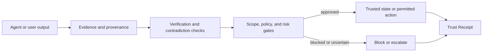

# HUQAN

### Models generate. Agents act. Memory stores. **HUQAN judges.**

HUQAN is a **local-first judgment and verification layer** for AI claims, memory writes, and risky actions. It connects decisions to evidence, scope, policy, approval, and auditable Trust Receipts.

[](./package.json)
[](https://nodejs.org/)
[](./LICENSE)
[](#why-huqan)
[](#how-it-works)

[Quick start](#quick-start) · [Why HUQAN](#why-huqan) · [How it works](#how-it-works) · [Ways to run](#ways-to-run) · [Current scope](#current-scope)

<p align="center">
  
</p>

## What is HUQAN?

AI systems can produce useful outputs without showing:

- what source supports a claim,
- which workspace or scope applies,
- whether a risky action was approved,
- what changed later,
- or why a result was allowed, blocked, or escalated.

HUQAN adds a trust boundary around those decisions.

```text
claim or action
      ↓
evidence + scope + policy
      ↓
verification + risk gates
      ↓
ALLOW / BLOCK / ESCALATE
      ↓
Trust Receipt + audit context
```

HUQAN is not another LLM and does not require a cloud model for its tested core local paths.

## Why HUQAN?

| Need | HUQAN provides |
|---|---|
| **Repeatable decisions** | Deterministic verification and policy outcomes on tested paths |
| **Evidence traceability** | Provenance, graph evidence, reasoning context, and receipt links |
| **Safer actions** | Explicit review, block, escalation, and dry-run boundaries |
| **Protected memory** | Admission and workspace checks before canonical memory writes |
| **Auditability** | Trust Receipts and append-oriented audit records |
| **Local operation** | CLI, local server, and MCP flows without a required cloud dependency |

## Quick start

### Requirements

- Node.js **18 or newer**
- npm
- A compiler toolchain may be required if your platform cannot use a prebuilt `better-sqlite3` binary

### Install and verify

```bash
git clone https://github.com/ali-ulu/huqan.git
cd huqan
npm ci --include=optional
npm test
```

### Start the CLI

```bash
node cli.js
```

Example controlled statements:

```text
Smoking causes lung cancer
Vaccination prevents disease
Authentication enables secure access
Growth depends on investment
```

HUQAN currently handles explicit supported relation markers. It is not a general-purpose natural-language understanding engine.

## How it works



The main runtime layers are:

```text
CLI / REST / MCP / local UI
            ↓
agent routing and task dispatch
            ↓
safety gates and approval boundaries
            ↓
verification and graph reasoning
            ↓
provenance, receipts, and memory admission
            ↓
SQLite-backed local state and audit records
```

## Ways to run

### Local CLI

```bash
node cli.js
```

### Local REST server

Mutation endpoints require an API key.

```bash
AXIOM_API_KEY=replace-with-a-secret node server.js
```

The server starts at `http://localhost:3000`.

Useful endpoints:

| Endpoint | Method | Purpose |
|---|---:|---|
| `/health` | GET | Health check |
| `/api?q=...` | GET | Allowlisted read-only query surface |
| `/graph-data` | GET | Knowledge graph export |
| `/verify` | POST | Guarded verification |
| `/v2/verify` | POST | Guarded structured verification |
| `/upload` | POST | Guarded load alias |

Authenticated mutation requests use `X-API-Key` or `Authorization: Bearer <key>`.

### MCP server for Claude or Cursor

```bash
node mcpServer.js
```

Claude Desktop configuration:

```json
{
  "mcpServers": {
    "huqan": {
      "command": "node",
      "args": ["/absolute/path/to/huqan/mcpServer.js"]
    }
  }
}
```

## Core capabilities

- Graph-backed claim verification
- Contradiction detection
- Explicit `CAUSES`, `PREVENTS`, `ENABLES`, and `DEPENDS_ON` relations
- Memory admission and workspace isolation
- Risk classification and safety gates
- Approval flows for guarded actions
- Provenance and audit records
- Canonical Trust Receipts and receipt chains
- Portable `.axiom` package primitives
- CLI, REST, MCP, and local UI surfaces

## Current scope

HUQAN is currently a **local-first partial trust layer**.

What is real today:

- verification, graph, provenance, approval, audit, and receipt primitives,
- local CLI, REST, MCP, and UI surfaces,
- bounded memory and action gates,
- package and cryptographic foundations.

What this repository does **not** currently claim:

- universal truth or hallucination elimination,
- complete inline enforcement for every connector and mutation path,
- a finished V5 shared-trust ecosystem,
- a public agent marketplace or certification network,
- Wikipedia-scale graph performance,
- a complete autonomous Self-Healer.

For the live execution order and exact limitations, read [docs/current-operating-roadmap.md](./docs/current-operating-roadmap.md).

## Repository map

| Path | Purpose |
|---|---|
| `kernel.js`, `graph.js` | Verification and graph reasoning core |
| `lib/` | Gates, provenance, memory, receipts, viewers, and supporting modules |
| `cli.js` | Local command-line interface |
| `server.js` | Local REST server and UI delivery |
| `mcpServer.js` | MCP integration |
| `public/` | Backend-connected local UI |
| `demo/` | Static public demo |
| `test/` and `*.test.js` | Automated test coverage |
| `docs/` | Architecture, audits, product boundaries, and roadmap |

## Development

```bash
npm test
npm run bench
npm run bench:verify
```

Focused test commands are available in [`package.json`](./package.json).

## Documentation

- [Current operating roadmap](./docs/current-operating-roadmap.md)
- [Product surfaces](./docs/product-surfaces.md)
- [Competitive positioning](./docs/competitive-positioning.md)
- [NLP boundary](./docs/nlp-boundary.md)
- [Scale truth pack](./docs/scale-truth-pack.md)
- [Governance](./docs/governance.md)
- [Security policy](./SECURITY.md)
- [Contributing](./CONTRIBUTING.md)

## License

Apache License 2.0. See [LICENSE](./LICENSE) and [NOTICE](./NOTICE).

---

**HUQAN:** trust and evidence infrastructure for AI-mediated work.
