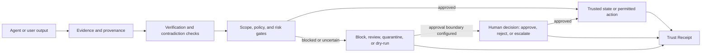

# HUQAN

**HUQAN is a local-first verification layer that sits between an AI agent producing an output and that output being trusted.** It attaches evidence and provenance to a claim, checks it against a local graph, runs the configured policy gates, holds risky writes and actions for human approval, and emits a Trust Receipt — an auditable record of why the result was allowed, held, or refused.

It is not a language model, a truth oracle, or a promise that hallucinations disappear. It is the audit boundary in front of them.

[](https://www.npmjs.com/package/huqan)
[](https://nodejs.org/)
[](./LICENSE)
[](https://github.com/ali-ulu/huqan/actions/workflows/conformance.yml)

[Quick start](#quick-start) · [How it works](#how-it-works) · [Ways to run](#ways-to-run) · [What it does not do](#what-huqan-does-not-do) · [FAQ](#faq)

<p align="center">
  
</p>

## Quick start

Requires **Node.js 22.13.0 or newer** (22 LTS or 24 LTS recommended). No API key, no config file, no hosted model.

```bash
npx -y huqan quickstart
```

That runs the whole loop against a throwaway store in your temp directory — propose a mutating write, get it held for review, approve it, perform the canonical write, verify the claim against the graph, print the receipt:

```text
HUQAN quickstart — learn -> review -> approve -> verify -> Trust Receipt
  1. OK   propose: huqan.learn -> review (mutating_requires_review), approval approval-…
  2. OK   approve: huqan.approve -> approved (actor cli-quickstart)
  3. OK   verify: verified (confidence 0.90)
  4. OK   receipt: receiptId … (status canonical)
```

It does not touch your own memory store and does not relax a gate.

To install for real:

```bash
npm install -g huqan
```

That gives you three commands: `huqan` (CLI), `huqan-mcp` (MCP server over stdio), and `huqan-gate` (pre-execution guard for external agents).

From a source checkout instead:

```bash
git clone https://github.com/ali-ulu/huqan.git
cd huqan
npm ci
node cli.js quickstart
```

PDF ingest (`pdfjs-dist`) and PDF receipt export (`pdfkit`) are optional dependencies; `npm install -g huqan --omit=optional` skips them. JSON receipt export is unaffected.

## The problem

An agent writes to memory, opens a PR, calls a tool, or states a fact. The output looks fine. Six questions stay unanswered:

- What evidence supports this?
- Where did it come from, and which workspace does it belong to?
- Did anything contradict it?
- Which policy decided it was safe?
- Did a person approve it, or did it just happen?
- What is left to audit afterwards?

Most of the stack answers none of these. Model evals score the model offline. Observability tools record what happened after it happened. IAM decides who may call the API, not whether this particular claim earned the write. HUQAN occupies the remaining gap: a deterministic decision, made before the write, with a durable record of why.

| You want | Where it lives |
|---|---|
| Is the model good in general? | Eval and benchmark suites |
| What did the agent do last night? | Observability and tracing |
| May this identity call this API? | IAM and access control |
| **Should this specific output be trusted, right now, before it lands?** | **HUQAN** |

## How it works

```text
claim, memory write, or agent action
                ↓
evidence + provenance + workspace scope
                ↓
verification + contradiction + risk checks
                ↓
policy decision and approval boundary
                ↓
ALLOW / REVIEW / QUARANTINE / DRY-RUN ONLY / BLOCK / REJECT
                ↓
Trust Receipt + audit context
```

Not every outcome is available on every path. The gate that guards tool calls answers `allow`, `review`, `dry_run_only` or `block`. The memory admission gate adds `quarantine` and `reject`, because a write can be held aside for inspection rather than refused outright.

**Escalation is a decision a person makes, not one the gate returns.** Where an approval boundary is configured, a reviewer can escalate a pending case instead of deciding it: the case moves to `escalated` and nothing executes until the authority it was raised to decides. That is a multi-party control, so it earns its place in an organization with more than one approver and is simply absent in a single-user install — there is no second authority to raise a case to. The decision types are `approve`, `reject`, `expire`, `cancel`, `escalate` and `override`; see [`lib/human-oversight-approval-runtime.js`](./lib/human-oversight-approval-runtime.js).



A passing verification is not a certificate of truth. It is a result produced inside the configured evidence, provenance, workspace, policy, and runtime boundary — and the receipt says which boundary that was.

## What you get

| Capability | What it actually does |
|---|---|
| Graph-backed verification | Checks claims and relationships against the local knowledge graph |
| Evidence and provenance | Carries source and decision context through verification and into the receipt |
| Contradiction detection | Surfaces conflicting evidence instead of accepting every claim silently |
| Memory admission | Canonical memory writes pass admission and workspace checks first |
| Policy and risk gates | Supported actions resolve to `allow`, `review`, `quarantine`, `dry_run_only`, `block`, or `reject` |
| Human approval | Guarded mutations can require a separate approval before the write or action runs |
| Trust Receipts | Canonical, chainable records of evidence, provenance, decision, and audit context |
| Agent Action Firewall | HUQAN-owned paths plus `huqan-gate`, an agent-independent pre-execution contract |
| Error Prevention core | Verified-failure memory, governed rule lifecycle, deterministic preflight |
| Developer surfaces | Library, CLI, local REST server, MCP server, local UI, read-only receipt viewer |

Explicit causal relations at the natural-language boundary are `CAUSES`, `PREVENTS`, `ENABLES`, and `DEPENDS_ON`. HUQAN is not a general-purpose NLU engine; see [NLP boundary](./docs/nlp-boundary.md).

## Ways to run

### MCP server for Claude, Cursor, and other clients

```json
{
  "mcpServers": {
    "huqan": {
      "command": "npx",
      "args": ["-y", "--package=huqan", "huqan-mcp"]
    }
  }
}
```

`--package=huqan` is required because the binary name differs from the package name. From a source checkout use `"command": "node"` with `"args": ["/absolute/path/to/huqan/mcpServer.js"]`.

The model-visible catalog covers learning, grounded questions, verification, planning, bounded agent execution, ingest preview and status, policy inspection, reasoning traces, comparison, hypothesis generation, advocacy, scoped search, receipt reading, and recursive knowledge synthesis (`huqan.fractal-learn`, whose optional `autoTune` mode is one-way — it can tighten its own thresholds but never loosen them).

Three operator tools are deliberately withheld from `tools/list` and require `HUQAN_MCP_OPERATOR_TOKEN`:

| Tool | Purpose |
|---|---|
| `huqan.approve` | Approve or reject a pending approval |
| `huqan.approvals` | List pending approvals |
| `huqan.agent_resume` | Resume a suspended agent run |

That separation is the point: **a model that proposes a mutating action cannot approve it through the catalog it can see.** Operator capabilities are single-use and the record of a spent one is durable — consumed nonces are written to `.huqan-capability-nonces` beside the memory store, so a used capability stays used across restarts and workers. Set `HUQAN_MCP_CAPABILITY_NONCE_DIR` to point every worker at one shared writable directory when the default is not on shared storage; if that directory cannot be written, capability verification fails closed.

### As a library

```js
const Kernel = require('huqan');       // KernelV2, the canonical runtime
const kernel = new Kernel();
```

`require('huqan')` resolves to `KernelV2`, the runtime behind the CLI, REST server, and MCP server. `require('huqan').KernelV1` remains reachable but is deprecated.

The package root also exposes the Error Prevention core:

```js
const { createErrorPrevention } = require('huqan');
const prevention = createErrorPrevention(kernel.memory, { verifyEvidence, resolveApproval });
```

### Local REST server

Mutation endpoints require an API key:

```bash
HUQAN_API_KEY=replace-with-a-secret npm run server
```

Serves `http://localhost:3000`.

| Endpoint | Method | Purpose |
|---|---:|---|
| `/health` | GET | Health check |
| `/api?q=...` | GET | Allowlisted read-only query surface |
| `/graph-data` | GET | Knowledge graph export |
| `/verify` | POST | Guarded verification |
| `/v2/verify` | POST | Guarded structured verification |
| `/upload` | POST | Guarded load alias |

Authenticated mutations use `X-API-Key` or `Authorization: Bearer <key>`. Read the route contract and workspace authorization policy before exposing the server beyond its intended boundary.

### Local UI and Trust Receipt Viewer

`npm run server` also serves the local UI at `public/index.html` and the read-only Trust Receipt Viewer at `/viewer`, which renders receipts already owned by that server. Neither is a mutation surface or a public demo. For a telemetry, alerts, and queue-state walkthrough see [Observability Quickstart](./docs/product-hunt-quickstart.md).

### Guarding an external agent

`huqan-gate` is a brand-independent pre-execution guard with a generic envelope, shipped with Claude Code, Codex, OpenCode, Pi, and Hermes projections. **It is enforcement only when the client actually calls it before executing.** A hookless client needs a wrapper, gateway, or sandbox — HUQAN does not claim an unconnected agent is governed. See [External action guard](./docs/external-action-guard.md).

### Optional Rust accelerator

`huqan-core` is an optional JSON-IPC graph accelerator. Nothing in the CLI, server, MCP, or canonical `kernel.learn()` path requires it; when the binary is absent, the JavaScript path is the reference behavior.

```bash
cd huqan-core && cargo build --release && cd ..
node benchmarks/rust-vs-js-graph.js 2000
```

Set `HUQAN_RUST_BIN` to select a binary elsewhere. The benchmark reports no Rust throughput when no binary is present.

## Current scope

Shipped and bounded: local verification, graph, provenance, approval, audit, receipt, memory, action-gate, CLI, REST, MCP, UI, and package primitives, plus two repository-run conformance suites:

```bash
npm run conformance:external
npm run conformance:a2a
```

These are evidence for the cases they cover. They are not third-party certification.

**A2A routes are deployment-gated.** Four routes mount through `lib/a2a/routes.js` — `POST /api/a2a/exchange`, `GET /.well-known/agent-card.json`, `POST /api/a2a/negotiate`, `GET /api/a2a/tasks/{taskId}`. With `HUQAN_A2A_AUTHORITY_FILE` and `HUQAN_A2A_REPLAY_DIR` unset they answer `404` rather than `401`, so an unconfigured install never advertises a surface it cannot serve. See [A2A deployment](./docs/a2a-deployment.md).

**Some modules are implemented but not production-reachable.** They pass unit tests without being reached by the production entry-point graph in [`lib/module-reachability.js`](./lib/module-reachability.js) — currently bounded V5, Self-Healer, and connector entries. A passing unit test for such a module proves isolated behavior, not that the installed product runs it. Check the live report and the [Current Operating Roadmap](./docs/current-operating-roadmap.md) before calling any of them available.

## What HUQAN does not do

Stated plainly, because a verification tool that oversells itself has refuted its own thesis:

- It does not eliminate hallucinations or establish universal truth.
- It does not enforce every connector, agent, or mutation path inline — coverage depends on what is actually wired.
- It does not ship a finished V5 shared-trust ecosystem, a public agent marketplace, a certification network, or a reputation economy.
- It does not claim external third-party interoperability for the A2A transport.
- It does not reach Wikipedia-scale graph performance.
- It does not ship a complete autonomous Self-Healer.
- It does not treat a design document, a roadmap entry, or an isolated unit test as production evidence.
- It does not replace IAM, application security, infrastructure security, data protection, or human governance.

## FAQ

**Is HUQAN an AI model?**
No. It is a governance and verification layer around AI-assisted workflows. It does not replace the model that produced the output.

**Does HUQAN stop hallucinations?**
No. It makes a hallucination inspectable and blockable before it becomes a memory entry, a decision, or a real action — and leaves a record either way.

**What is a Trust Receipt?**
An auditable record of one verification or governance decision: the evidence, provenance, scope, risk, review, approval, and outcome that produced it. It certifies the process, not the truth of the claim.

**Can HUQAN actually block an agent action?**
On wired paths, yes — `allow`, `review`, `dry_run_only`, and `block` are real outcomes. External agents go through the `huqan-gate` envelope, but the hook or wrapper must be installed before execution. Verify coverage for your specific client, connector, mutation path, identity, and policy.

**Does it need the cloud?**
No. The core graph, verification, gate, and receipt paths run locally with no hosted model. Optional adapters and deployment-gated surfaces have their own requirements.

**What does "partial trust" mean?**
A result is judged inside explicit evidence, provenance, workspace, policy, approval, and runtime boundaries. No model output, memory entry, connector, or external action is trusted automatically.

**Where do I start?**
`npx -y huqan quickstart`, read the receipt it prints, then the guide for whichever boundary you care about.

## Repository map

| Path | Purpose |
|---|---|
| `index.js`, `index.d.ts` | Package exports and public type surface |
| `kernel.js`, `graph.js` | Verification and graph reasoning core |
| `lib/` | Gates, provenance, memory, receipts, viewer, adapters |
| `cli.js` | Local CLI entry point |
| `server.js` | Local REST server and UI delivery |
| `mcpServer.js`, `bin/huqan-mcp.js` | MCP integration and package binary |
| `public/` | Local UI and read-only viewer |
| `test/`, `*.test.js` | Automated test coverage |
| `docs/` | Architecture, audits, contracts, roadmap |
| `scripts/` | Conformance, pilot, benchmark, tooling |

## Development

```bash
npm ci
npm test
```

Focused checks: `npm run test:cli`, `test:server`, `test:plugin`, `test:backup`, `conformance:external`, `conformance:a2a`, `bench`, `bench:verify`.

A passing focused test is evidence for that focused behavior. It is not full-suite or production evidence without the corresponding CI and runtime proof.

## Documentation

[Operating roadmap](./docs/current-operating-roadmap.md) ·
[Product surfaces](./docs/product-surfaces.md) ·
[Competitive positioning](./docs/competitive-positioning.md) ·
[Agent Action Firewall](./docs/agent-action-firewall.md) ·
[External action guard](./docs/external-action-guard.md) ·
[A2A deployment](./docs/a2a-deployment.md) ·
[Scale truth pack](./docs/scale-truth-pack.md) ·
[Governance](./docs/governance.md) ·
[Threat model](./THREAT_MODEL.md) ·
[Security policy](./SECURITY.md) ·
[Contributing](./CONTRIBUTING.md) ·
[Issues](https://github.com/ali-ulu/huqan/issues) ·
[Discussions](https://github.com/ali-ulu/huqan/discussions)

When a claim in any summary needs checking, these repository sources win over it: [product surfaces](./docs/product-surfaces.md), the [operating roadmap](./docs/current-operating-roadmap.md), [module reachability](./lib/module-reachability.js), and [`package.json`](./package.json).

## License

GNU Affero General Public License v3.0, `AGPL-3.0-only`. See [LICENSE](./LICENSE) and [NOTICE](./NOTICE).

A separate commercial license is being prepared for organizations needing proprietary use of covered components. **Those terms are not yet operative and this repository grants no commercial rights.**

External contributions will be subject to the project's approved contributor rights process. [`CLA.md`](./CLA.md) is currently the review draft `HUQAN-ICLA-v1.0-review` and is not an operative agreement. Review contact: Ali Ulu, `aliulu@ai-ulu.com` — publishing this contact grants no rights and activates no CLA. See [`CONTRIBUTING.md`](./CONTRIBUTING.md).

---

**Confidence is not truth. Verify before you trust.**
