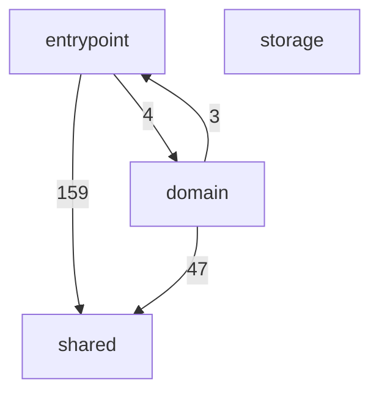

```mermaid
flowchart TB
  entrypoint["entrypoint"]
  domain["domain"]
  storage["storage"]
  shared["shared"]
  entrypoint -->|"4"| domain
  entrypoint -->|"159"| shared
  domain -->|"3"| entrypoint
  domain -->|"47"| shared
```

_Generated by `node scripts/architecture-snapshot.js --mermaid` (#2641)._
