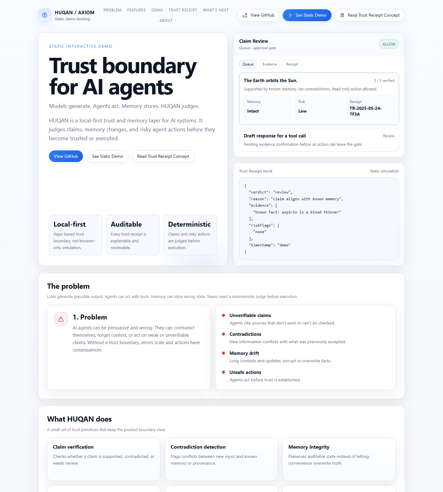
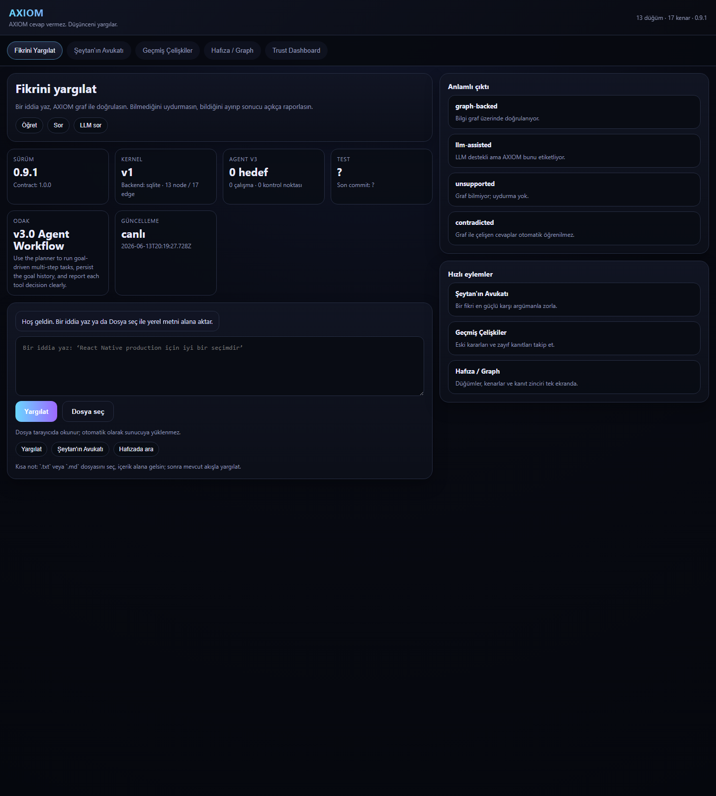

# Product Surfaces

HUQAN has three visible HTML surfaces in the repository, plus one planned
surface that was never built. This note makes their roles explicit so
contributors and external viewers do not treat them as competing products.

## Canonical surfaces

### 1. Public static demo — not in this repository

Planned file: `demo/index.html`

**Status: absent.** The PTD-2 decision below described this surface, but no
`demo/` directory has ever been committed. It is recorded here as a planned
surface so the split stays legible, not as something a contributor can deploy
today.

Intended role, if it is ever built:
- a static simulation, safe to host without API keys or a running server
- backend-free concept framing for GitHub Pages, Vercel, or Cloudflare Pages

What it would still not be:
- not live engine output
- not a connected verification console
- not a source of production Trust Receipts

Until it exists, the only shareable non-local artifact is the Trust Receipt
Viewer at `/viewer`, which does require a running server.

### 2. Canonical local developer UI

Canonical file: `public/index.html`

Use this surface when:
- running `node server.js`
- testing the backend-connected UI locally
- exercising real verification, graph, and trust flows against the local engine

What it is:
- the local backend-connected interface
- the main interactive developer surface
- the UI that reflects the running HUQAN server; its title is
  `HUQAN — Trust Command Center`

What it is not:
- not the public static marketing/demo landing
- not intended for static hosting without the local server

### 3. Docs entry surface

Canonical file: `docs/index.html`

Decision:
- keep it as a lightweight chooser page
- do not maintain it as a third competing product demo

Purpose:
- route visitors to the static demo
- route developers to install and usage docs
- make the surface split obvious without inventing another UI story

What it is not:
- not a fourth product mode
- not a second static demo
- not a backend-connected app

### 4. Read-only Trust Receipt Viewer

Canonical files: `public/viewer/` served through `lib/viewer/viewer-gateway.js`

Reachable at `/viewer` on a running server; its title is
`HUQAN Receipt Terminal`. It is the V4-B4 client trust artifact: read-only,
restrictive CSP, `no-store`, and a strict same-origin session exchange, so a
non-browser client is refused with `cross_origin` rather than served.

It is a fourth *surface* but not a fourth *product mode*: it renders receipts
the local server already owns.

## Deploy guidance

- Static public demo: not deployable — `demo/index.html` does not exist
- Local product UI: serve `public/index.html` through `node server.js`
- Trust Receipt Viewer: served at `/viewer` by the same `node server.js`
- Docs entry: optional repo/docs landing only

## Guardrails

- No backend, API keys, analytics, or telemetry would be required for the static
  demo surface, if it is built.
- The local UI should be treated as a developer/operator surface, not a public static landing.
- The viewer is read-only by contract; it must never grow a mutation path.
- Product surface policy is now explicit; PTD-2 closes the ambiguity, not the UX roadmap.
