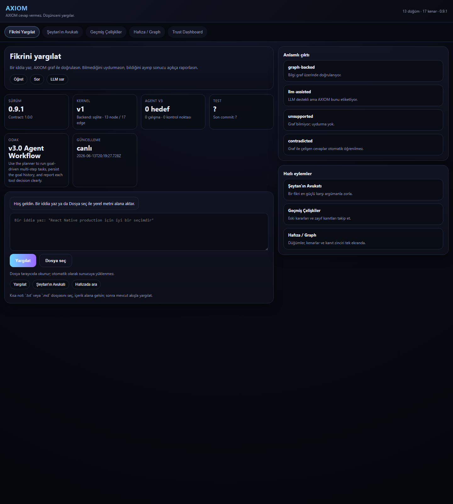

# Product Surfaces

HUQAN has five primary visible HTML surfaces in the repository, plus
deployment-gated specialist consoles such as PR Guardian. This note makes the
primary roles explicit so contributors and external viewers do not treat them
as competing products.

## Canonical surfaces

### 1. Public static demo

Canonical file: `demo/index.html`

**Status: present.** The repository now ships a backend-free 60-second
simulation intended for public concept framing.

Use this surface when:
- explaining HUQAN without asking someone to install the package;
- hosting a static demonstration through GitHub Pages, Vercel, Cloudflare Pages,
  or another static host;
- showing BLOCK and REVIEW -> human approval -> execution as a bounded example.

What it is:
- static HTML/CSS/JavaScript;
- backend-free;
- no API keys;
- no telemetry;
- safe to inspect without a running HUQAN server.

What it is not:
- not live engine output;
- not a connected verification console;
- not a source of production Trust Receipts;
- not evidence that a deployment exists.

### 2. Canonical local developer UI

Canonical file: `public/index.html`

Use this surface when:
- running `node server.js`;
- testing the backend-connected UI locally;
- exercising real verification, graph, and trust flows against the local engine.

What it is:
- the local backend-connected interface;
- the main interactive developer/operator surface;
- the UI that reflects the running HUQAN server; its title is
  `HUQAN — Trust Command Center`.

What it is not:
- not the public static marketing/demo landing;
- not intended for static hosting without the local server.

### 3. Operator Control Room

Canonical files: `public/control-room/`, served by
`lib/http/static-assets.js` at `/control-room`.

**Status: present, local/runtime-backed.** Use this surface for the daily
operator questions: what agents attempted, what HUQAN decided, what needs human
approval, and what receipt/evidence backs a decision.

What it is:
- a backend-connected operator dashboard over real local HUQAN endpoints;
- workspace-scoped through the browser session;
- a real approvals/activity/receipt surface;
- home of the outcome-driven first-run path, whose steps complete only after
  successful runtime evidence.

What it is not:
- not hosted SaaS or proof of multi-tenant deployment;
- not SSO, billing or a durable agent-registry console;
- not evidence that planned "Coming soon" capabilities exist;
- not a replacement for the read-only Receipt Viewer.

### 4. Docs entry surface

Canonical file: `docs/index.html`

Decision:
- keep it as a lightweight chooser page;
- do not maintain it as a competing product demo.

Purpose:
- route visitors to the static demo;
- route developers to install and usage docs;
- make the surface split obvious without inventing another UI story.

What it is not:
- not a fifth product mode;
- not a second static demo;
- not a backend-connected app.

### 5. Read-only Trust Receipt Viewer

Canonical files: `public/viewer/` served through
`lib/viewer/viewer-gateway.js`.

Reachable at `/viewer` on a running server; its title is
`HUQAN Receipt Terminal`. It is the V4-B4 client trust artifact: read-only,
restrictive CSP, `no-store`, and a strict same-origin session exchange, so a
non-browser client is refused with `cross_origin` rather than served.

It is a primary *surface* but not an independent product mode: it renders
receipts the local server already owns.

## Deploy guidance

- Static public demo: `demo/index.html` can be deployed by a static host. The
  repository currently does not treat static hosting as proof of a HUQAN runtime
  deployment.
- Local product UI: serve `public/index.html` through `node server.js`.
- Operator Control Room: served at `/control-room` by the same local server.
- Trust Receipt Viewer: served at `/viewer` by the same `node server.js`.
- Docs entry: optional repository/docs landing only.

## Guardrails

- The static demo requires no backend, API keys, analytics, or telemetry.
- The static demo must remain explicit that it is a simulation.
- The local UI should be treated as a developer/operator surface, not a public
  static landing.
- The Control Room reports only capabilities backed by current runtime data;
  best-effort actor visibility must not be described as a durable agent
  registry/heartbeat.
- The viewer is read-only by contract; it must never grow a mutation path.
- Static hosting and a live HUQAN deployment are different claims and must stay
  visibly separate.
